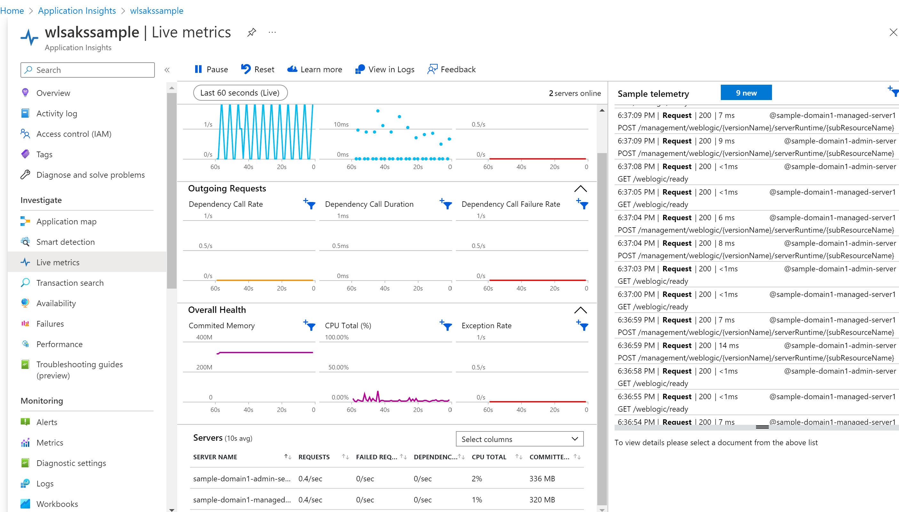

# Monitor WebLogic on AKS using Azure Application Insight

## Prerequisites

* Azure Subscription. The user should have Owner role in the subscription to deploy the WebLogic on AKS offer.
* Development environment. The sample will run shell commands. You can run the commands in [Azure Cloud Shell](https://learn.microsoft.com/en-us/azure/cloud-shell/overview). If you prefer to run on you local machine, the following tools are required:
    * [Azure CLI](https://docs.microsoft.com/cli/azure); use `az --version` to test if az works. This document was tested with version 2.43.0.
    * [kubectl](https://kubernetes-io-vnext-staging.netlify.com/docs/tasks/tools/install-kubectl/); use `kubectl version` to test if `kubectl` works. This document was tested with version v1.21.1.

## Deploy WebLogic on AKS offer

* Open [WebLogic on AKS offer](https://portal.azure.com/#create/oracle.20210620-wls-on-aks20210620-wls-on-aks) from your browser.
* Fill in the following fileds:
    * **Basics** blade
        * Subscription: select your subscription.
        * Resource group: click Create new, input a name.
        * Region: East US.
        * Username for WebLogic Administrator: `weblogic`.
        * Password for WebLogic Administrator: input a password and confirm the password.
        * Password for WebLogic Model encryption： input a password and confirm the password.
    * **AKS** blade
        * Image selection
            * Create a new Azure Container Registry to store application images? Select Yes.
            * Username for Oracle Single Sign-On authentication: input your oracle SSO account name.
            * Password for Oracle Single Sign-On authentication: input your password and confirm password.
            * Select the type of WebLogic Server Images: General WebLogic Server Images
            * Docker tag: 14.1.1.0-11
        * Application
            * Deploy an application: Yes
            * Application package (.war,.ear,.jar): select your application.
        * Advanced
            * Create Persistent Volume using Azure File share service: checked.
    * Fill in values for other blades es you expect.
    * Click **Review + create** to deploy the offer.

After the deployment finishes, you will have the WLS cluster up and mount an Azure file share to the pods.

## Create Azure Application Insight

* Search **application insights** from Azure portal and open Application Insights.
* Fill in the following fileds:
    * Subscription: select your subscription.
    * Resource group: click Create new, input a name.
    * Name: input a name.
    * Region: East US.
* Click **Review + create** to deploy Application Insights. 

After the deployment finishes, open the Application Insight instance, from **Overview** page, copy value of **Connection String** and save it to a file. You will use it later.

## Monitor WebLogic and Applciations

1. Upload java library
    * Download [applicationinsights-agent-3.4.7.jar](resources/applicationinsights-agent-3.4.7.jar) and save it to your machine.
    * From Azure portal, go to the resource group that has WebLogic and AKS deployed.
    * Select the storage account and open it.
    * Select **Data storage**, **File shares**, you will find there is a file share named `weblogic`.
    * Select **weblogic**, click **Add directory** and create a directory with name `libs`.
    * Select **libs** and upload **applicationinsights-agent-3.4.7.jar** to this directory.

2. Connect to AKS
    * Open Azure Cloud Shell or your local bash terminal.
    * Connect to AKS with the following command:

        ```bash
        az account set --subscription <your-sub-id>
        az aks get-credentials --resource-group <aks-resource-group> --name <aks-name>
        ```
    * Run the following commands to connect to Application Insights. Replace the `APPLICATIONINSIGHTS_CONNECTION_STRING` with your value.

        ```bash
        WLS_DOMAIN_NS=sample-domain1-ns
        WLS_DOMAIN_UID=sample-domain1
        APPLICATIONINSIGHTS_CONNECTION_STRING="InstrumentationKey=xxxxxx"
        AGENT_PATH="-javaagent:/shared/libs/applicationinsights-agent-3.4.7.jar"

        JAVA_OPTIONS=$(kubectl -n ${WLS_DOMAIN_NS} get domain ${WLS_DOMAIN_UID} -o json | jq '. | .spec.serverPod.env | .[] | select(.name=="JAVA_OPTIONS") | .value' | tr -d "\"")
        JAVA_OPTIONS="${AGENT_PATH} ${JAVA_OPTIONS}"

        JAVA_OPTIONS_INDEX=$(kubectl -n ${WLS_DOMAIN_NS} get domain ${WLS_DOMAIN_UID} -o json  | jq '.spec.serverPod.env | map(.name == "JAVA_OPTIONS") | index(true)')

        VERSION=$(kubectl -n ${WLS_DOMAIN_NS} get domain ${WLS_DOMAIN_UID} -o json | jq '. | .spec.restartVersion' | tr -d "\"")
        VERSION=$((VERSION+1))

        cat <<EOF >patch-file.json
        [
            {
                "op": "replace",
                "path": "/spec/restartVersion",
                "value": "${VERSION}"
            },
            {
                "op": "remove",
                "path": "/spec/serverPod/env/${JAVA_OPTIONS_INDEX}"
            },
            {
                "op": "add",
                "path": "/spec/serverPod/env/-",
                "value": {
                    "name": "APPLICATIONINSIGHTS_CONNECTION_STRING",
                    "value": "${APPLICATIONINSIGHTS_CONNECTION_STRING}"
                }
            },
            {
                "op": "add",
                "path": "/spec/serverPod/env/-",
                "value": {
                    "name": "JAVA_OPTIONS",
                    "value": "${JAVA_OPTIONS}"
                }
            }
        ]
        EOF

        kubectl -n ${WLS_DOMAIN_NS} patch domain ${WLS_DOMAIN_UID} \
                --type=json \
                --patch-file patch-file.json

        kubectl get pod -n ${WLS_DOMAIN_NS} -w
        ```
3. Now, you are able to access metrics of WLS from application insight.

    